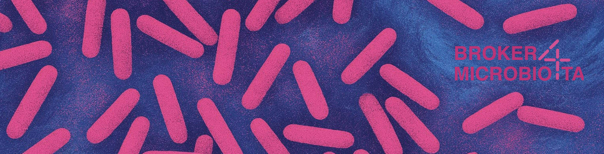

# Broker4Microbiota



A Django-based metadata collection and management system for microbiome sequencing facilities. Streamlines the process of collecting sequencing orders, managing sample metadata according to MIxS standards, and submitting data to the European Nucleotide Archive (ENA).

## Video Tutorials

### 1. User Workflow Demo
Learn how researchers can create projects, submit sequencing orders, and manage sample metadata.

[](https://youtu.be/b5yww53tUD0)

[Watch on YouTube →](https://youtu.be/b5yww53tUD0)

### 2. Sequencing Center View
See how sequencing center staff can manage orders, update status, and process samples.

[](https://youtu.be/kKdj-RZW71s)

[Watch on YouTube →](https://youtu.be/kKdj-RZW71s)

### 3. ENA Registration
Learn how to register samples and submit metadata to the European Nucleotide Archive.

[](https://youtu.be/xZtsPTJjfLk)

[Watch on YouTube →](https://youtu.be/xZtsPTJjfLk)

### 4. MAG Pipeline Integration
Discover how to run the nf-core/mag pipeline directly from the platform.

[](https://youtu.be/G7HnhQFTHL8)

[Watch on YouTube →](https://youtu.be/G7HnhQFTHL8)

## About The Project

This project, "Establishing data broker functionalities at HZI for optimizing omics data submissions to public repositories," is funded by HZI through the NFDI4Microbiota Strategy Funds in 2023. The initiative aims to enhance the submission process of omics data to public repositories, making it more efficient and streamlined.


## Key Features

- **Sequencing Order Management**: Create and track sequencing orders with comprehensive metadata
- **MIxS Standards Compliance**: Built-in support for 17 MIxS environmental checklists
- **ENA Integration**: Direct submission to European Nucleotide Archive
- **Pipeline Integration**: Execute nf-core/mag and other bioinformatics pipelines
- **Excel Import/Export**: Bulk data management through spreadsheets
- **Multi-facility Support**: Customizable for different sequencing centers
- **Dynamic Forms**: Flexible form system that adapts to facility needs

## Quick Start

### Prerequisites
- Python 3.8 or newer
- Git
- Nextflow (for bioinformatics pipelines)

### Installation

```bash
# Clone the repository
git clone https://github.com/hzi-bifo/Broker4Microbiota.git
cd Broker4Microbiota

# Run the automated setup script
./setup.sh
```

The setup script will:
- Create a virtual environment
- Install all dependencies
- Set up the database
- Configure initial settings

### Running the Application

```bash
# Activate virtual environment
source venv/bin/activate

# Start the development server
cd project
python manage.py runserver
```

Access the application at `http://127.0.0.1:8000/`

### Running Background Tasks

In a separate terminal:
```bash
source venv/bin/activate
cd project
python manage.py qcluster
```

## Configuration

### ENA Account Setup

1. Register at [ENA](https://ena-docs.readthedocs.io/en/latest/submit/general-guide/registration.html)
2. Wait 24 hours before attempting submissions
3. Configure credentials through Admin Settings interface

### Environment Variables

Copy `TEMPLATE.env` to `.env` and configure:
- ENA credentials
- Field encryption key
- Project paths
- HPC/Slurm settings (if applicable)

## Documentation

For detailed documentation on:
- Installation and setup
- Configuration options
- Development guidelines
- API endpoints
- Troubleshooting


## Support

For issues, questions, or contributions:
- [GitHub Issues](https://github.com/hzi-bifo/Broker4Microbiota/issues)

## Funding

This project is supported by the NFDI4Microbiota Strategy Funds, granted by the Helmholtz Centre for Infection Research (HZI).