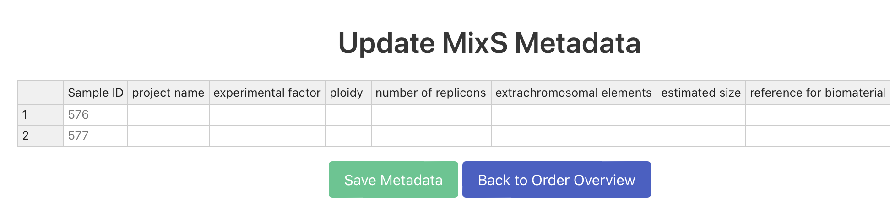

# ngs_orders

This is a Django App for collection and storage of sequenicing orders for the sequencing facility. After registration/login the user can define orders, associate samples to a order and associate samples to  MIxS Sample Checklists.

## About The Project

This project, "Establishing data broker functionalities at HZI for optimizing omics data submissions to public repositories," is funded by HZI through the NFDI4Microbiota Strategy Funds in 2023. The initiative aims to enhance the submission process of omics data to public repositories, making it more efficient and streamlined.


## Funding

This project is supported by the NFDI4Microbiota Strategy Funds, granted by the Helmholtz Centre for Infection Research (HZI) to facilitate the development of data broker functionalities for optimizing omics data submissions to public repositories.

## Installation

This project is developed with Django. To set up and run the project locally, follow these steps:

### Prerequisites

- Python (3.8 or newer)
- pip (Python package installer)
- Nextflow (see https://www.nextflow.io/docs/latest/install.html). Please test the installation using `nextflow run nf-core/mag -profile test,docker --outdir test`
- add nexflow to conda env

### Setting Up a Virtual Environment

It's recommended to use a virtual environment for Python projects. This keeps dependencies required by different projects separate. To create a virtual environment, run:

```bash
python3 -m venv myenv
source myenv/bin/activate
```


### Installing Dependencies

```bash
pip install Django
pip install requests
pip install biopython
pip install phonenumbers
pip install django-widget-tweaks
pip install django-phonenumber-field
pip install xmltodict
pip install django-q2
pip install nextflow
```

### Running the Project

Navigate to the project directory and run:


```bash
cd project
python manage.py collectstatic
python manage.py runserver
```

This will start the Django development server, and you should be able to access the project at `http://127.0.0.1:8000/`.


## Configuration 

### ENA account

Register an ENA account (see https://ena-docs.readthedocs.io/en/latest/submit/general-guide/registration.html) and add the credentials to your environment. For example, on a Unix-like system, you can add the following lines to your .bashrc, .bash_profile, or .profile file:

```bash
export ENA_USERNAME='Webin-XXXXXX'
export ENA_PASSWORD='XXXXXXXXXX'
```

after createing an ENA account, please wait 24h due to a known bug that prevents test submissions https://github.com/enasequence/read_docs/issues/161

### Changes on the Order form

The Order form can be changed by modifying the class OrderForm in `myapp/forms.py` and the `models.py`file that defines the SQL fields. Updates on the SQL tables requires migration of the table layout.

```bash
python manage.py makemigrations
python manage.py migrate
```

### Configuration of MIxS Sample Checklists

The application comes with 14 MIxS Sample Checklists that are downloaded from https://www.ebi.ac.uk/ena/browser/checklists. These are stored and can be changed and updated under `staticfiles/xml/EnviornmentID.xml`. These IDs should match `MIXS_METADATA_STANDARDS` defined in `mixs_metadata_standards.py`. After the .xml files are changed, run `python manage.py collectstatic` to update the static files. 

## Excel Sync

To generate a .xlsx file with the database content run:

```bash
python manage.py sync_excel
```

To import from a .xlsx file (similar structure as the output of the sync_excel command) run:

```bash
python manage.py sync_excel --import /path/to/your/excel/file.xlsx
```

## Application Screenshots

Below are some screenshots that display the key functionalities of the application, including user registration/login, order creation, associating samples to an order, and associating samples to MIxS standards.

### User Registration/Login


This screenshot shows the user registration and login page, allowing users to access the application.

### Order Overview


Here, you can see the interface for listing all orders associated with the user. The user can create new orders on the page and edit orders or fill out other metadata.

### Order Creation


Here, you can see the interface for creating a new sequencing order. These values can be updated by the user at any time. 

### Sample Association


This screenshot displays how a user can associate a oder to one or more samples. 

### Associating MIxS Standards




This image shows the functionality for associating samples with specific MIxS standards on the sample view. On the overview page there will now be a button/form for each standtart selected to all samples (Here: Air/Soil for Order 2 and Air/Soil/Host-associated for order 3)


### Admin View
 


The site admin (sequencing center) can login and make changes to all data stored in the database
 


On the samples view the admin can select samples and can run a nf-core mag pipeline if he enters the file names for these samples. The output folder location path will be then written to the database. 


A table showing all the pipeline runs (nf-core mag) for the samples or sample sets. 


The admin can also register the samples to ENA, the XML fields will then be auto-generated based on the samples selected. 
