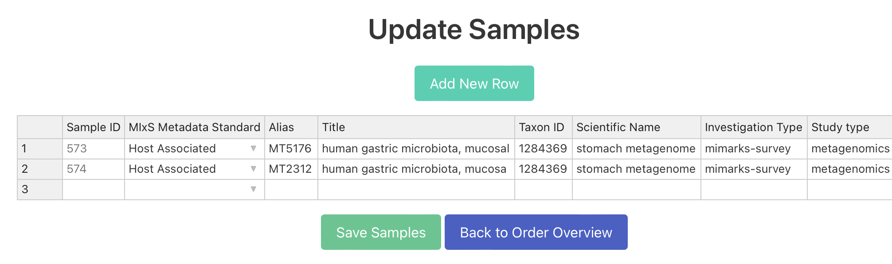
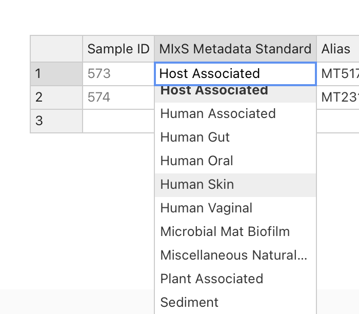

# ngs_orders

This is a Django App for collection and storage of sequenicing orders for the sequencing facility. After registration/login the user can define orders, associate samples to a order and associate samples to  MIxS Sample Checklists.

## About The Project

This project, "Establishing data broker functionalities at HZI for optimizing omics data submissions to public repositories," is funded by HZI through the NFDI4Microbiota Strategy Funds in 2023. The initiative aims to enhance the submission process of omics data to public repositories, making it more efficient and streamlined.


## Funding

This project is supported by the NFDI4Microbiota Strategy Funds, granted by the Helmholtz Centre for Infection Research (HZI) to facilitate the development of data broker functionalities for optimizing omics data submissions to public repositories.

## Installation

This project is developed with Django. To set up and run the project locally, follow these steps:

### Prerequisites

- Python 3.8 or newer
- pip (Python package installer)
- Git
- Nextflow (for bioinformatics pipelines)
- Conda (optional, for bioinformatics tools like bwa and samtools)

### Quick Setup (Recommended)

We provide an automated setup script that handles most of the installation steps:

```bash
# Clone the repository
git clone https://github.com/hzi-bifo/Broker4Microbiota.git
cd Broker4Microbiota

# Run the setup script
./setup.sh
```

The setup script will:
- Check Python version compatibility
- Create a virtual environment
- Install all Python dependencies
- Create a `.env` file from the template
- Set up the Django database
- Collect static files
- Optionally create a superuser account

### Manual Setup

If you prefer to set up manually or the script doesn't work on your system:

#### 1. Create and activate a virtual environment

```bash
python3 -m venv venv
source venv/bin/activate  # On Windows: venv\Scripts\activate
```

#### 2. Install Python dependencies

```bash
pip install --upgrade pip
pip install -r requirements.txt
```

#### 3. Set up environment variables

```bash
cp TEMPLATE.env .env
# Edit .env file with your settings (see Configuration section below)
```

#### 4. Set up Django

```bash
cd project
python manage.py collectstatic --noinput
python manage.py makemigrations
python manage.py migrate
python manage.py createsuperuser  # Optional: create admin account
```

#### 5. Install additional tools (optional)

**Nextflow** (required for running bioinformatics pipelines):
```bash
# Install Nextflow
curl -s https://get.nextflow.io | bash
sudo mv nextflow /usr/local/bin/

# Test Nextflow installation
nextflow run nf-core/mag -profile test,docker --outdir test
```

**Bioinformatics tools** (if using Conda):
```bash
conda install -c bioconda bwa samtools
```

### Running the Development Server

After setup is complete:

```bash
# Make sure virtual environment is activated
source venv/bin/activate  # On Windows: venv\Scripts\activate

# Start the development server
cd project
python manage.py runserver
```

The application will be available at `http://127.0.0.1:8000/`

### Running Background Tasks

To process asynchronous tasks (like pipeline runs), start the Django-Q cluster in a separate terminal:

```bash
source venv/bin/activate
cd project
python manage.py qcluster
```


## Configuration 

### Environment Variables

The application uses environment variables for sensitive configuration. After running the setup script or copying `TEMPLATE.env` to `.env`, edit the `.env` file with your settings:

```bash
# ENA (European Nucleotide Archive) credentials
ENA_USERNAME=Webin-XXXXXX      # Your ENA Webin account username
ENA_USER=                       # Alternative ENA username field (if needed)
ENA_PASSWORD=your_password_here # Your ENA account password

# Project paths
ROOT_DIR=$HOME/git/django_ngs_metadata_collection  # Adjust to your project location

# HPC/Slurm configuration (for computational clusters)
USE_SLURM_FOR_SUBMG=False      # Set to True if using Slurm job scheduler
CONDA_PATH=                     # Path to conda installation (if using Slurm)
```

### ENA Account Setup

1. **Register an ENA account** at https://ena-docs.readthedocs.io/en/latest/submit/general-guide/registration.html
2. **Important**: After creating an ENA account, wait 24 hours before attempting submissions due to a [known synchronization issue](https://github.com/enasequence/read_docs/issues/161)
3. Your username will be in the format `Webin-XXXXXX`
4. Add your credentials to the `.env` file (never commit this file to version control)

### Dynamic Form Templates System

The application now supports a dynamic form system that allows different sequencing facilities to customize their forms without modifying code. Forms are defined using JSON templates and can be managed through the Django admin interface.

#### Loading Form Templates

To load the default form templates into the database:

```bash
python manage.py load_form_templates
```

This will load the following templates:
- **Create Sequencing Order v1.0** - Default order form template
- **HZI Sequencing Order Form v1.0** - Facility-specific order form for Helmholtz Centre
- **Create New Sequencing Project v1.0** - Default project form template

#### Managing Form Templates

**Via Admin Interface:**
1. Log in to Django admin at `/admin/` with superuser credentials
2. Navigate to "Form Templates" under the APP section
3. Here you can:
   - View existing templates
   - Edit JSON schemas directly
   - Create new templates
   - Clone existing templates for customization
   - Activate/deactivate templates

**Via JSON Files:**
1. Form templates are stored in `project/app/form_templates/`
2. To create a new template:
   ```bash
   # Copy an existing template
   cp project/app/form_templates/order_form_default.json project/app/form_templates/order_form_mycenter.json
   
   # Edit the JSON file with your customizations
   # Then load it into the database
   python manage.py load_form_templates --file order_form_mycenter.json
   ```

#### Customizing Forms

Form templates support:
- **Field Types**: text, email, phone, number, date, textarea, select, checkbox, file upload, etc.
- **Validation**: Required fields, regex patterns, min/max values, custom validators
- **Conditional Fields**: Show/hide fields based on other field values
- **Expandable Help**: Rich help content that expands on click
- **Sections**: Organize fields into collapsible sections
- **Facility-Specific Forms**: Different forms for different facilities

Example of customizing a field in the JSON:
```json
{
  "field_name": "experiment_title",
  "field_type": "text",
  "label": "Experiment Title",
  "required": true,
  "help_text": "Brief descriptive title",
  "validation": {
    "min_length": 10,
    "max_length": 200
  },
  "expandable_help": {
    "enabled": true,
    "content": {
      "title": "Guidelines for Experiment Title",
      "description": "The title should be concise yet descriptive..."
    }
  }
}
```

#### Exporting Form Templates

To export current templates from the database:
```bash
python manage.py export_form_templates --output-dir exports/
```

#### Form Template Documentation

For detailed documentation on the form template structure and all available options, see:
`project/app/form_templates/README.md`

### Changes on the Order form (Legacy Method)

For simple changes, you can still modify the class OrderForm in `myapp/forms.py` and the `models.py` file that defines the SQL fields. Updates on the SQL tables requires migration of the table layout.

```bash
python manage.py makemigrations
python manage.py migrate
```

Note: We recommend using the dynamic form templates system for form customization as it doesn't require code changes or deployments.

### Site Branding Configuration

The application supports customizable branding through the Django admin interface. This allows different organizations to adapt the platform without code changes.

#### Accessing Site Settings
1. Log in to Django admin at `/admin/` with superuser credentials
2. Navigate to "Site Settings" 
3. Edit the settings to customize your instance

#### Configurable Options
- **Organization Information**: Name, short name, and website URL
- **Contact Details**: Primary contact email
- **Visual Branding**: Upload custom logo and favicon
- **Theme Colors**: Customize primary and secondary colors
- **Site Identity**: Application name and tagline
- **Footer Content**: Additional HTML content for the footer

All changes take effect immediately after saving.

### Configuration of MIxS Sample Checklists

The application comes with 14 MIxS Sample Checklists that are downloaded from https://www.ebi.ac.uk/ena/browser/checklists. These are stored and can be changed and updated under `staticfiles/xml/EnviornmentID.xml`. These IDs should match `MIXS_METADATA_STANDARDS` defined in `mixs_metadata_standards.py`. After the .xml files are changed, run `python manage.py collectstatic` to update the static files. 

## Excel Sync

To generate a .xlsx file with the database content run:

```bash
python manage.py sync_excel
```

To import from a .xlsx file (similar structure as the output of the sync_excel command) run:

```bash
python manage.py sync_excel --import /path/to/your/excel/file.xlsx
```

## Application Screenshots

Below are some screenshots that display the key functionalities of the application, including user registration/login, order creation, associating samples to an order, and associating samples to MIxS standards.

### User Registration/Login


This screenshot shows the user registration and login page, allowing users to access the application.

### Order Overview


Here, you can see the interface for listing all orders associated with the user. The user can create new orders on the page and edit orders or fill out other metadata.

### Order Creation


Here, you can see the interface for creating a new sequencing order. These values can be updated by the user at any time. 

### Sample Association



This screenshot displays how a user can associate a oder to one or more samples. 

### Associating MIxS Standards




This image shows the functionality for associating samples with specific MIxS standards on the sample view. On the overview page there will now be a button/form for each standtart selected to all samples (Here: Air/Soil for Order 2 and Air/Soil/Host-associated for order 3)


## Troubleshooting

### Common Issues

**ImportError: No module named 'django'**
- Make sure you've activated the virtual environment: `source venv/bin/activate`
- If that doesn't work, reinstall dependencies: `pip install -r requirements.txt`

**Database errors on first run**
- Run migrations: `cd project && python manage.py migrate`
- If you get migration conflicts, try: `python manage.py makemigrations && python manage.py migrate`

**Static files not loading (CSS/JS missing)**
- Run: `cd project && python manage.py collectstatic`
- Make sure `DEBUG = True` in `project/settings.py` for development

**Permission denied when running setup.sh**
- Make the script executable: `chmod +x setup.sh`
- Or run with bash: `bash setup.sh`

**ENA submission failures**
- Ensure you've waited 24 hours after creating your ENA account
- Check that your credentials in `.env` are correct
- Verify your ENA account at https://www.ebi.ac.uk/ena/submit/webin/login

### Admin View
 


The site admin (sequencing center) can login and make changes to all data stored in the database
 


On the samples view the admin can select samples and can run a nf-core mag pipeline if he enters the file names for these samples. The output folder location path will be then written to the database. 


A table showing all the pipeline runs (nf-core mag) for the samples or sample sets. 


The admin can also register the samples to ENA, the XML fields will then be auto-generated based on the samples selected. 
